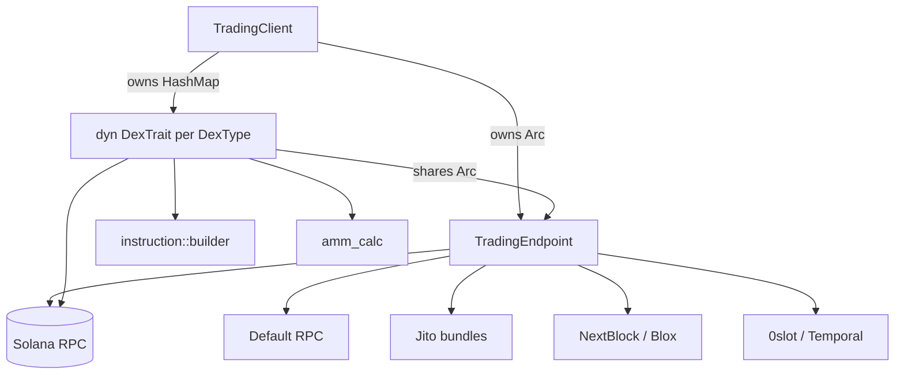
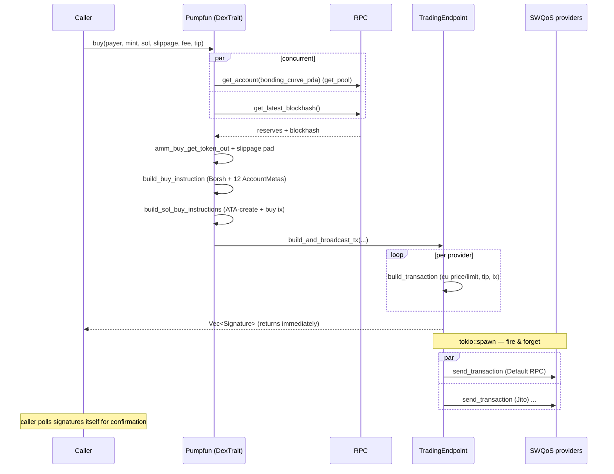

# Solana Trading SDK — Architecture Reference

> **Why this doc exists.** We are building our own Solana trading API
> (`solana-trading-api`, edition 2024). The LulzFi SDK is a clean, well-factored
> example of the *pattern* we want — trait-based DEX abstraction, multi-provider
> transaction broadcast, AMM math, token creation — but it's pinned to older
> crates and a few dated on-chain assumptions. This file documents **how it
> works** in full, then maps **what's old → what's current** so we can copy the
> good ideas and skip the rot.

---

## 1. TL;DR — what the SDK actually is

It's a Rust library that lets you **buy / sell / create memecoins** across several
Solana launchpad DEXs (Pump.fun, PumpSwap, Raydium Launchpad/Bonk, Boopfun, …)
and **broadcast the resulting transaction through many "SWQoS" providers at once**
(plain RPC, Jito bundles, NextBlock, bloXroute, 0slot, Temporal) to maximize the
odds of landing in a block fast.

The whole thing rests on **two traits and two factory enums**:

| Abstraction      | Role                                                                 |
| ---------------- | -------------------------------------------------------------------- |
| `DexTrait`       | One DEX. Knows how to read a pool and build buy/sell/create ix.      |
| `SWQoSTrait`     | One transaction-submission backend. Knows how to send a signed tx.   |
| `DexType` (enum) | Factory: maps a variant → a boxed `DexTrait` impl.                   |
| `SWQoSType` (enum)| Factory: maps a variant → a boxed `SWQoSTrait` impl.                |

Everything else (the client, the endpoint, the instruction builder, the AMM
math) is glue that wires those two traits together.

---

## 2. The big picture

```
                         ┌──────────────────────────────────────┐
                         │            TradingClient              │  ← composition root
                         │  - endpoint: Arc<TradingEndpoint>     │
                         │  - dexs: HashMap<DexType, Arc<dyn DexTrait>>
                         └───────────────┬──────────────────────┘
                                         │ owns
                  ┌──────────────────────┴───────────────────────┐
                  │                                               │
        ┌─────────▼──────────┐                         ┌──────────▼───────────┐
        │   TradingEndpoint  │                         │   dexs (per DexType)  │
        │  - rpc: RpcClient  │                         │  Pumpfun / PumpSwap / │
        │  - swqos: Vec<dyn  │◀───── shared Arc ───────│  RayBonk / Boopfun /  │
        │    SWQoSTrait>     │      (endpoint)          │  Believe / MeteoraDBC │
        └─────────┬──────────┘                         └──────────┬───────────┘
                  │ build + fan-out                               │ build instructions
                  │                                               │
   ┌──────────────┼───────────────────────────┐                  │
   ▼              ▼              ▼              ▼                  ▼
┌────────┐  ┌─────────┐   ┌──────────┐   ┌──────────┐     ┌──────────────────┐
│ Default│  │  Jito   │   │ NextBlock│   │  0slot / │     │ instruction::     │
│  RPC   │  │ bundles │   │  /Blox   │   │ Temporal │     │ builder           │
└────────┘  └─────────┘   └──────────┘   └──────────┘     │ (tx assembly,     │
   each implements SWQoSTrait::send_transaction(s)        │  SOL vs WSOL,     │
                                                          │  compute budget,  │
                                                          │  tips)            │
                                                          └──────────────────┘
```

Mermaid version (renders in most MDX viewers):



**The mental model:** a DEX produces *instructions*; the endpoint wraps them into
a *transaction* and *fans it out* to every SWQoS provider concurrently.

---

## 3. Crate / module layout

```
src/
├── lib.rs                      # pub mod instruction, ipfs, dex, swqos, common
├── main.rs                     # runnable examples (transfer/swap/create)
│
├── common/
│   ├── mod.rs                  # re-exports trading_client::*
│   ├── accounts.rs             # PUBKEY_WSOL constant
│   ├── trading_client.rs       # TradingConfig, TradingClient  (composition root)
│   └── trading_endpoint.rs     # TradingEndpoint  (RPC + SWQoS broadcaster)
│
├── instruction/
│   ├── mod.rs
│   └── builder.rs              # build_transaction + SOL/WSOL ix wrappers, PriorityFee, TipFee
│
├── dex/
│   ├── mod.rs
│   ├── dex_traits.rs           # DexTrait  (the template-method trait — buy/sell/batch live here)
│   ├── types.rs                # PoolInfo, SwapInfo, Create, DexType, TokenAmountType, CreateATA, batch params
│   ├── amm_calc.rs             # constant-product math + slippage
│   ├── pumpfun.rs              # bonding-curve DEX
│   ├── pumpfun_types.rs        # program IDs, seeds, account layouts, CreateInfo
│   ├── pumpfun_common_types.rs # BuyInfo/SellInfo ix payloads (shared with pumpswap)
│   ├── pumpswap.rs             # AMM DEX (uses WSOL)
│   ├── pumpswap_types.rs
│   ├── raydium_bonk.rs (+_types)
│   ├── boopfun.rs (+_types)
│   ├── meteora_dbc.rs (+_types)
│   ├── moonit.rs (+_types)     # Moonshot — "coming soon"
│   └── believe.rs              # "coming soon"
│
├── swqos/
│   ├── mod.rs                  # SWQoSType enum + SWQoSTrait + instantiate()
│   ├── swqos_rpc.rs            # shared HTTP/JSON-RPC plumbing (base64 tx, POST, error handling)
│   ├── default.rs              # DefaultSWQoSClient (plain RPC; also 0slot/Temporal reuse it) + transfers
│   ├── jito.rs                 # Jito: /transactions + /bundles (sendBundle)
│   ├── nextblock.rs            # NextBlock: /api/v2/submit (+ submit-batch)
│   ├── blox.rs                 # bloXroute
│   ├── zeroslot.rs             # tip-account list
│   └── temporal.rs             # tip-account list
│
└── ipfs/
    ├── mod.rs
    ├── metadata.rs             # create_token_metadata → Pinata pinFileToIPFS + pinJSONToIPFS
    └── types.rs                # CreateTokenMetadata, TokenMetadata, TokenMetadataIPFS
```

Dependencies (`Cargo.toml`, the dated set):

```toml
solana-sdk = "2.3.0"            # monolithic — see §13
solana-client = "2.3.0"
solana-program = "2.3.0"
solana-rpc-client = "2.3.0"
solana-transaction-status = "2.3.0"
solana-account-decoder = "2.3.0"
spl-token = "8.0.0"
spl-token-2022 = { version = "9.0.0", features = ["no-entrypoint"] }
spl-associated-token-account = "7.0.0"
mpl-token-metadata = "5.1.0"
borsh = { version = "1.5.3", features = ["derive"] }
serde = { version = "1", features = ["derive"] }
serde_json = "1"
futures = "0.3"
rand = "0.9.0"
bincode = "1.3.3"              # v1 — see §13
anyhow = "1"
reqwest = { version = "0.12", features = ["json", "multipart", "rustls-tls"] }
tokio = { version = "1", features = ["full", "rt-multi-thread"] }
async-trait = "0.1"
once_cell = "1"
base64 = "0.22"
```

---

## 4. The two core abstractions

### 4.1 `DexTrait` — the template-method pattern (the most important file)

`dex/dex_traits.rs`. This trait is where the design pays off: the **high-level
trading flow lives in default methods**, and each DEX only implements the small
DEX-specific pieces. You implement ~6 methods; you get `buy`, `sell`,
`batch_buy`, `batch_sell` for free.

```rust
#[async_trait::async_trait]
pub trait DexTrait: Send + Sync + Any {
    // ── you MUST implement these per DEX ──────────────────────────────
    async fn initialize(&self) -> anyhow::Result<()>;            // fetch global config account once
    fn initialized(&self) -> anyhow::Result<()>;                 // guard: error if not initialized
    fn use_wsol(&self) -> bool;                                  // bonding-curve=false, AMM=true
    fn get_trading_endpoint(&self) -> Arc<TradingEndpoint>;
    async fn get_pool(&self, mint: &Pubkey) -> anyhow::Result<PoolInfo>;
    async fn create(&self, payer: Keypair, create: Create, fee, tip) -> Result<Vec<Signature>>;
    fn build_buy_instruction(&self, payer, mint, creator_vault, buy: SwapInfo)  -> Result<Instruction>;
    fn build_sell_instruction(&self, payer, mint, creator_vault, sell: SwapInfo) -> Result<Instruction>;

    // ── you get these FOR FREE (default impls) ────────────────────────
    async fn buy(...)              // get_pool + blockhash → quote → buy_immediately
    fn buy_immediately(...)        // build ix → wrap (SOL/WSOL) → broadcast
    async fn sell(...)             // get_pool + blockhash + balance → quote → sell_immediately
    fn sell_immediately(...)
    async fn batch_buy(...)        // walk reserves locally, build N txs, send as one bundle
    async fn batch_sell(...)
}
```

**Key flow — `buy` (default method):**

```rust
async fn buy(&self, payer, mint, sol_amount, slippage_bps, fee, tip) -> Result<Vec<Signature>> {
    let ep = self.get_trading_endpoint();
    // 1. fetch pool reserves and a fresh blockhash CONCURRENTLY
    let (pool, blockhash) = tokio::try_join!(self.get_pool(mint), ep.get_latest_blockhash())?;
    // 2. quote: how many tokens for this SOL, using constant-product math
    let token_out = amm_buy_get_token_out(pool.sol_reserves, pool.token_reserves, sol_amount);
    // 3. pad the SOL by slippage (max we're willing to spend)
    let max_sol = calculate_with_slippage_buy(sol_amount, slippage_bps);
    // 4. hand off to buy_immediately (no more network reads)
    self.buy_immediately(payer, mint, pool.extra_address.as_ref(),
                         max_sol, token_out, blockhash, CreateATA::Idempotent, fee, tip)
}
```

`buy_immediately` is the "I already have a quote and blockhash, just send it"
path — useful for sniping where you precompute everything:

```rust
fn buy_immediately(&self, payer, mint, extra_address, sol_amount, token_amount,
                   blockhash, create_ata, fee, tip) -> Result<Vec<Signature>> {
    let ix = self.build_buy_instruction(payer, mint, extra_address,
                                        SwapInfo { token_amount, sol_amount })?;
    // wrap with ATA-create (+ WSOL plumbing if this DEX needs it)
    let instructions = if self.use_wsol() {
        build_wsol_buy_instructions(payer, mint, sol_amount, ix, create_ata)?
    } else {
        build_sol_buy_instructions(payer, mint, ix, create_ata)?
    };
    self.get_trading_endpoint()
        .build_and_broadcast_tx(payer, instructions, blockhash, fee, tip, None)
}
```

> **Pattern to copy:** put the orchestration (quote → slippage → wrap → broadcast)
> in default trait methods; leave only `get_pool` + `build_*_instruction` +
> `use_wsol` to each DEX. Adding a DEX becomes a ~200-line file, not a rewrite.

**`batch_buy` is subtle and worth stealing:** instead of one RPC quote per buyer,
it fetches the pool *once* and then **simulates the reserve movement locally** as
it walks the buyer list, so each subsequent buyer is priced against the
post-previous-buy reserves:

```rust
let mut pool_token = pool.token_reserves;
let mut pool_sol   = pool.sol_reserves;
for item in items {
    let max_sol   = calculate_with_slippage_buy(item.sol_amount, slippage_bps);
    let token_out = amm_buy_get_token_out(pool_sol, pool_token, item.sol_amount);
    let ix = self.build_buy_instruction(&item.payer, mint, pool.creator_vault.as_ref(), ...);
    batch_items.push(BatchTxItem { payer: item.payer, instructions });
    pool_sol   += item.sol_amount;   // advance the curve
    pool_token -= token_out;
}
// all N txs go out as one Jito bundle (atomic-ish, same blockhash)
ep.build_and_broadcast_batch_txs(batch_items, blockhash, fee, tip).await
```

### 4.2 `SWQoSTrait` — the strategy pattern for tx submission

`swqos/mod.rs`. Every submission backend implements:

```rust
#[async_trait::async_trait]
pub trait SWQoSTrait: Send + Sync + Any {
    async fn send_transaction(&self, tx: VersionedTransaction) -> Result<()>;
    async fn send_transactions(&self, txs: Vec<VersionedTransaction>) -> Result<()>; // batch/bundle
    fn get_tip_account(&self) -> Option<Pubkey>;   // None = no tip needed (plain RPC)
    fn get_name(&self) -> &str;
}
```

`get_tip_account()` is the clever bit. It returns `Some(pubkey)` for providers
that require a tip (Jito/NextBlock/0slot/Temporal/Blox) and `None` for plain RPC.
The endpoint uses this to decide whether to inject a tip-transfer instruction —
see §6.

---

## 5. Layer 1 — `TradingClient` (composition root / factory)

`common/trading_client.rs`. Tiny. It builds everything from a config and stores
the DEXs in a `HashMap` keyed by `DexType`.

```rust
pub struct TradingConfig {
    pub rpc_url: String,
    pub swqos: Vec<SWQoSType>,
}

pub struct TradingClient {
    pub endpoint: Arc<TradingEndpoint>,
    pub dexs: HashMap<DexType, Arc<dyn DexTrait>>,
}

impl TradingClient {
    pub fn new(config: TradingConfig) -> Result<Self> {
        let rpc = Arc::new(RpcClient::new(config.rpc_url));
        // each SWQoSType → boxed SWQoSTrait, sharing the one RPC client
        let swqos = config.swqos.into_iter()
            .map(|s| s.instantiate(rpc.clone())).collect();
        let endpoint = Arc::new(TradingEndpoint::new(rpc, swqos));
        // EVERY known DexType is instantiated, all sharing the one endpoint
        let dexs = DexType::all().into_iter()
            .map(|d| (d, d.instantiate(endpoint.clone()))).collect();
        Ok(Self { endpoint, dexs })
    }

    pub async fn initialize(&self) -> Result<()> {
        for (_, dex) in &self.dexs { dex.initialize().await?; }  // fetch each DEX's global account
        Ok(())
    }
}
```

Usage:

```rust
let client = TradingClient::new(TradingConfig {
    rpc_url: "https://solana-rpc.publicnode.com".into(),
    swqos: vec![
        SWQoSType::Default("https://solana-rpc.publicnode.com".into(), None),
        SWQoSType::Jito("https://mainnet.block-engine.jito.wtf".into()),
    ],
})?;
client.initialize().await?;                 // MUST call before trading (loads global accounts)
client.dexs[&DexType::Pumpfun]
    .buy(&payer, &mint, sol_to_lamports(1.0), 3000, Some(fee), Some(tip)).await?;
```

> **Gotcha:** `client.dexs[&DexType::X]` panics if you index a DEX that wasn't
> built. Since `DexType::all()` builds them all, that's fine here — but
> `initialize()` calls `dex.initialize()` for *every* DEX, so one launchpad's RPC
> hiccup fails the whole init. In our version, make init lazy/per-DEX.

---

## 6. Layer 2 — `TradingEndpoint` (the broadcaster)

`common/trading_endpoint.rs`. This holds the RPC client and the list of SWQoS
providers, and owns the **fan-out broadcast** logic. This is the heart of the
"land fast" strategy.

```rust
pub struct TradingEndpoint {
    pub rpc: Arc<RpcClient>,
    pub swqos: Arc<Vec<Arc<dyn SWQoSTrait>>>,
}
```

### 6.1 Single-transaction fan-out — `build_and_broadcast_tx`

For each SWQoS provider, build a *separate* signed transaction (because the tip
instruction differs per provider), then **spawn a background task** that sends
all of them concurrently. Returns the signatures immediately (fire-and-forget).

```rust
pub fn build_and_broadcast_tx(&self, payer, instructions, blockhash, fee, tip, other_signers)
    -> Result<Vec<Signature>>
{
    let mut signatures = vec![];
    let mut txs = Vec::new();

    for swqos in self.swqos.iter() {
        // decide the per-provider tip
        let tip = match swqos.get_tip_account() {
            Some(tip_account) => match tip {
                Some(tip) => Some(TipFee { tip_account, tip_lamports: tip }),
                None => { // provider needs a tip but caller gave none → skip it
                    eprintln!("No tip provided for SWQoS: {}", swqos.get_name());
                    txs.push(None);
                    continue;
                }
            },
            None => None, // plain RPC: no tip instruction
        };
        let tx = build_transaction(payer, instructions.clone(), blockhash, fee, tip, other_signers.clone())?;
        signatures.push(tx.signatures[0]);
        txs.push(Some(tx));
    }

    // fire-and-forget: send to all providers in parallel, log errors
    let all = self.swqos.clone();
    tokio::spawn(async move {
        let tasks = all.iter().zip(txs.iter())
            .filter_map(|(s, tx)| tx.as_ref().map(|tx| s.send_transaction(tx.clone())));
        let results = futures::future::join_all(tasks).await;
        // ... collect & eprintln! errors
    });

    Ok(signatures)  // returns BEFORE confirmation
}
```

Two things to internalize:

1. **One tx per provider, not one tx broadcast many times.** Because the tip is a
   `system_instruction::transfer` baked into the message, and each provider has a
   different tip account, each provider gets its own signed tx. They share the
   same blockhash and payload, so only one will land first; the rest fail as
   "already processed" — that's intentional and harmless.
2. **It does not wait for confirmation.** `build_and_broadcast_tx` returns the
   signatures and lets a detached task do the sending. The caller gets sigs to
   poll themselves. (See §13 — we'll want real confirmation tracking.)

### 6.2 Batch / bundle fan-out — `build_and_broadcast_batch_txs`

Used by `batch_buy`/`batch_sell`. Builds N transactions (one per `BatchTxItem`)
and submits them as a *batch* to each provider. Here the tip is attached to only
the **first** tx of the batch (`tip.take()` yields `Some` once, then `None`):

```rust
pub async fn build_and_broadcast_batch_txs(&self, items, blockhash, fee, tip) -> Result<Vec<Signature>> {
    for swqos in self.swqos.iter() {
        let tip_account = swqos.get_tip_account()
            .ok_or_else(|| anyhow!("No tip account for SWQoS: {}", swqos.get_name()))?;
        let mut tip = Some(TipFee { tip_account, tip_lamports: tip });
        let txs = items.iter()
            .map(|it| build_transaction(&it.payer, it.instructions.clone(),
                                        blockhash, Some(fee), tip.take(), None))  // tip only on tx[0]
            .collect::<Result<Vec<_>,_>>()?;
        signatures.extend(txs.iter().map(|t| t.signatures[0]));
        tasks.push(swqos.send_transactions(txs));
    }
    // this one DOES await all providers and returns errors (not fire-and-forget)
    let errors = join_all(tasks).await.into_iter().filter_map(|r| r.err()).collect::<Vec<_>>();
    if !errors.is_empty() { return Err(anyhow!("{:?}", errors)); }
    Ok(signatures)
}
```

Note the asymmetry: **batch requires every provider to have a tip account** (it
`?`-errors if not), whereas single-tx tolerates plain RPC. That's because batches
are meant for bundle-capable providers (Jito `sendBundle`, NextBlock
`submit-batch`).

---

## 7. Layer 3 — `instruction/builder.rs` (transaction assembly)

This module turns a list of `Instruction`s into a signed `VersionedTransaction`,
and provides the SOL-vs-WSOL wrapping logic.

### 7.1 Fee/tip types

```rust
pub struct PriorityFee { pub unit_limit: u32, pub unit_price: u64 } // CU limit + micro-lamports/CU
pub struct TipFee      { pub tip_account: Pubkey, pub tip_lamports: u64 }
```

### 7.2 `build_transaction` — the canonical tx builder

```rust
pub fn build_transaction(payer, instructions, blockhash, fee: Option<PriorityFee>,
                         tip: Option<TipFee>, other_signers) -> Result<VersionedTransaction> {
    let mut insts = vec![];
    if let Some(fee) = fee {
        insts.push(ComputeBudgetInstruction::set_compute_unit_price(fee.unit_price));
        insts.push(ComputeBudgetInstruction::set_compute_unit_limit(fee.unit_limit));
    }
    if let Some(tip) = tip {
        insts.push(system_instruction::transfer(&payer.pubkey(), &tip.tip_account, tip.tip_lamports));
    }
    insts.extend(instructions);   // ← the actual DEX ix come AFTER budget+tip

    // v0 message + ALT slot left EMPTY (&[]) — see §13, no address lookup tables
    let msg = v0::Message::try_compile(&payer.pubkey(), &insts, &[], blockhash)?;
    let signers = once(payer).chain(other_signers.unwrap_or_default()).collect::<Vec<_>>();
    VersionedTransaction::try_new(VersionedMessage::V0(msg), &signers)
}
```

Order of instructions in every tx: **`[set_cu_price, set_cu_limit, tip_transfer, ...dex_ix]`.**

### 7.3 SOL vs WSOL wrapping

Bonding-curve DEXs (Pump.fun) take native SOL directly → `use_wsol() == false`.
AMM DEXs (PumpSwap) trade against a WSOL token account → `use_wsol() == true`,
so the SDK must wrap/unwrap SOL around the swap.

**`build_sol_buy_instructions`** (native): optionally create the mint ATA, then the buy ix.

```rust
// CreateATA::Idempotent → create_associated_token_account_idempotent
// CreateATA::Create     → create_associated_token_account
// CreateATA::None       → nothing
[maybe create_ata(mint), buy_ix]
```

**`build_wsol_buy_instructions`** (AMM): create mint ATA + WSOL ATA, fund the WSOL
ATA with `sol_amount`, `sync_native`, do the buy, then **close the WSOL ATA** to
reclaim rent + leftover SOL:

```rust
[ maybe create_ata(mint),
  create_ata_idempotent(WSOL),
  system_transfer(payer → wsol_ata, sol_amount),
  sync_native(wsol_ata),
  buy_ix,
  close_account(wsol_ata → payer) ]
```

**`build_sol_sell_instructions`** / **`build_wsol_sell_instructions`** mirror this;
sells optionally `close_account(mint_ata)` when `close_mint_ata` is true (dust
cleanup / reclaim rent after dumping the full balance).

> `PUBKEY_WSOL = So11111111111111111111111111111111111111112` lives in
> `common/accounts.rs`.

---

## 8. Layer 4 — DEX implementations

Two archetypes. Learn these two and the rest are variations.

### 8.1 Bonding-curve DEX — `Pumpfun` (`dex/pumpfun.rs`)

State: an `OnceCell<Arc<GlobalAccount>>` populated by `initialize()`.

- **`initialize`**: `rpc.get_account(GLOBAL_ACCOUNT)` → `bincode::deserialize::<GlobalAccount>` → store in OnceCell.
- **`use_wsol`** → `false` (native SOL).
- **`get_pool`**: derive the bonding-curve PDA (`["bonding-curve", mint]`), read it,
  deserialize `BondingCurveAccount`, derive the creator vault PDA
  (`["creator-vault", creator]`). Reserves come straight off the curve account:

  ```rust
  PoolInfo {
      pool: bonding_curve_pda,
      creator: Some(curve.creator),
      creator_vault: Some(creator_vault),
      extra_address: Some(creator_vault),     // passed back into build_*_instruction
      token_reserves: curve.virtual_token_reserves,
      sol_reserves:   curve.virtual_sol_reserves,
      config: None,
  }
  ```

- **`build_buy_instruction`**: serialize `BuyInfo { discriminator, token_amount, sol_amount }`
  with Borsh, then a fixed 12-account `AccountMeta` list (global, fee recipient,
  mint, bonding curve, curve ATA, payer ATA, payer, system, token, **creator
  vault**, event authority, program). Built via `Instruction::new_with_bytes`.
- **`create`**: serialize `CreateInfo { discriminator, name, symbol, uri, creator }`,
  14-account list incl. the Metaplex metadata PDA, optionally append a first buy.
  The **mint keypair co-signs** (`other_signers = [mint_private_key]`).

Program constants (`pumpfun_types.rs`):

```rust
PUBKEY_PUMPFUN         = 6EF8rrecthR5Dkzon8Nwu78hRvfCKubJ14M5uBEwF6P
PUBKEY_GLOBAL_ACCOUNT  = 4wTV1YmiEkRvAtNtsSGPtUrqRYQMe5SKy2uB4Jjaxnjf
PUBKEY_EVENT_AUTHORITY = Ce6TQqeHC9p8KetsN6JsjHK7UTZk7nasjjnr7XxXp9F1
PUBKEY_FEE_RECIPIENT   = 62qc2CNXwrYqQScmEdiZFFAnJR262PxWEuNQtxfafNgV   // ⚠ single hardcoded — dated (§13)
seeds: "global" | "mint-authority" | "bonding-curve" | "creator-vault" | "metadata"
INITIAL_VIRTUAL_TOKEN_RESERVES = 1_073_000_000_000_000
INITIAL_VIRTUAL_SOL_RESERVES   =    30_000_000_000   // 30 SOL
```

### 8.2 AMM DEX — `PumpSwap` (`dex/pumpswap.rs`)

- **`use_wsol`** → `true`.
- **`get_pool`**: derive the pool PDA (`["pool", 0u16, pool_authority, mint, WSOL]`),
  read the pool account **and both vault token accounts concurrently**, and read
  reserves from the *token account balances* (not from the pool struct):

  ```rust
  let (pool_acc, base_acc, quote_acc) = tokio::try_join!(
      rpc.get_account(&pool),
      rpc.get_token_account(&pool_base),   // mint vault
      rpc.get_token_account(&pool_quote),  // WSOL vault
  )?;
  token_reserves = base_acc.token_amount.amount;   // string → u64
  sol_reserves   = quote_acc.token_amount.amount;
  ```

- **`build_buy_instruction`**: same `BuyInfo` payload as Pump.fun (shared
  `pumpfun_common_types`!), but a **19-account** list including both payer ATAs
  (mint + WSOL), both pool vaults, a **randomly chosen `protocol_fee_recipient`**
  from the global account, and the creator-vault WSOL ATA.
- **`create`** → returns `Err("Not supported")` (you migrate to PumpSwap *from*
  Pump.fun when the curve completes; you don't mint here).

> The reuse of `BuyInfo`/`SellInfo` across Pump.fun and PumpSwap (same Anchor
> instruction discriminators + arg layout) is why `pumpfun_common_types.rs`
> exists. Both programs share the `buy(amount, max_sol_cost)` ABI shape.

### 8.3 Instruction payloads — `pumpfun_common_types.rs`

```rust
pub struct BuyInfo  { pub discriminator: u64, pub token_amount: u64, pub sol_amount: u64 }
pub struct SellInfo { pub discriminator: u64, pub token_amount: u64, pub sol_amount: u64 }
// discriminators are precomputed Anchor sighashes stored as u64 LE:
//   buy  = 16927863322537952870
//   sell = 12502976635542562355
//   create (CreateInfo) = 8576854823835016728
// to_buffer() = Borsh-serialize the struct
```

> **This is the dated part #1:** the 8-byte Anchor discriminator is hardcoded as a
> magic `u64`. The correct, future-proof way is to compute
> `sha256("global:buy")[..8]` at build time. See §13.

---

## 9. The AMM math — `dex/amm_calc.rs`

Pure functions, constant-product (`x*y=k`), no fees baked in (fees are handled
on-chain / via slippage). Used by every DEX through the `DexTrait` defaults.

```rust
// tokens out for a given SOL in:  Δtoken = token_r - k/(sol_r + sol_in)
amm_buy_get_token_out(sol_r, token_r, sol_in) -> u64

// SOL needed to buy an exact token_out (inverse):  sol = sol_r*token_out/(token_r-token_out)
amm_buy_get_sol_in(sol_r, token_r, token_out) -> u64

// SOL out for tokens in:  sol = sol_r*token_in/(token_r + token_in)
amm_sell_get_sol_out(sol_r, token_r, token_in) -> u64

// slippage padding (basis points, 1% = 100 bps):
calculate_with_slippage_buy(amount, bps)  = amount + amount*bps/10000   // max we'll spend
calculate_with_slippage_sell(amount, bps) = amount - amount*bps/10000   // min we'll accept
```

All intermediate math is done in `u128` to avoid overflow, then cast back to
`u64`. Guard clauses return `0` for degenerate inputs (zero reserves, etc.).

---

## 10. SWQoS providers — deep dive

### 10.1 The factory — `SWQoSType::instantiate`

```rust
pub enum SWQoSType {
    Default(String, Option<(String,String)>), // (endpoint, optional auth header)
    Jito(String),                             // (endpoint)
    NextBlock(String, String),                // (endpoint, auth_token)
    Blox(String, String),
    Temporal(String, String),
    ZeroSlot(String, String),
}

// Note: 0slot and Temporal don't get their own client — they REUSE DefaultSWQoSClient
// with the auth token folded into the URL query string + a tip-account list:
SWQoSType::ZeroSlot(ep, key) => DefaultSWQoSClient::new("0slot", rpc,
        format!("{ep}?api-key={key}"), None, ZEROSLOT_TIP_ACCOUNTS.into()),
SWQoSType::Temporal(ep, key) => DefaultSWQoSClient::new("temporal", rpc,
        format!("{ep}?c={key}"),       None, TEMPORAL_TIP_ACCOUNTS.into()),
```

### 10.2 Shared HTTP plumbing — `swqos_rpc.rs`

A blanket `impl SWQoSClientTrait for reqwest::Client` gives every provider:

- `new_swqos_client()` — a reqwest client with a 10s timeout.
- `to_base64_string()` on `VersionedTransaction` — `bincode::serialize` → base64.
- `swqos_send_transaction` — standard JSON-RPC `sendTransaction` with
  `{ encoding: "base64" }`.
- `swqos_send_transactions` — `sendTransactions` (plural).
- `swqos_json_post` — the actual POST: applies optional auth header, enforces a
  10s timeout on send *and* body read, checks HTTP status and the JSON `error`
  field, logs success/failure with the tx signatures. **This is the only place
  errors are inspected.**

### 10.3 Per-provider differences

| Provider   | Client            | Endpoint path                 | Auth                          | Batch method            |
| ---------- | ----------------- | ----------------------------- | ----------------------------- | ----------------------- |
| Default    | `DefaultSWQoSClient` | (your RPC URL)             | optional header               | `sendTransactions`      |
| Jito       | `JitoClient`      | `/api/v1/transactions`, `/api/v1/bundles` | none           | `sendBundle`            |
| NextBlock  | `NextBlockClient` | `/api/v2/submit`, `/submit-batch` | `Authorization: <token>`  | custom `entries` array  |
| bloXroute  | `BloxClient`      | (blox path)                   | `Authorization: <token>`      | (blox batch)            |
| 0slot      | `DefaultSWQoSClient` | `?api-key=<key>`           | query string                  | `sendTransactions`      |
| Temporal   | `DefaultSWQoSClient` | `?c=<key>`                 | query string                  | `sendTransactions`      |

**Jito** is special — bundles use a different JSON method (`sendBundle`) and a
different URL than single tx, and it has region endpoints baked in as constants
(`JITO_ENDPOINT_MAINNET/MAS/FRA/LONDON/NY/TOKYO/SLC` + relayer hosts).

**Tip accounts**: each tip-requiring provider exposes a hardcoded `&[Pubkey]`
list and `get_tip_account()` picks one at random (`rand::seq::IndexedRandom::choose`).
Jito ships 8 tip accounts; NextBlock ships 8; 0slot/Temporal ship their own.

### 10.4 `DefaultSWQoSClient` also does transfers

Beyond `SWQoSTrait`, the default client has helper methods (used directly in
`main.rs`, not through `TradingClient`):

```rust
transfer(from, to, amount, fee)                 -> Signature   // native SOL
batch_transfer(from, Vec<TransferInfo>, fee)     -> Signature   // many recipients, one tx
spl_transfer(from, to, mint, amount, fee)        -> Signature   // SPL token (idempotent ATA-create)
spl_batch_transfer(from, Vec<TransferInfo>, mint, fee)
wait_for_confirm(&signature)                     -> Result<()>  // polls getTransaction up to 10s
```

`wait_for_confirm` is the *only* confirmation primitive in the SDK, and it's not
wired into the broadcast path.

---

## 11. Token creation + IPFS — `ipfs/`

`create_token_metadata(meta: CreateTokenMetadata, jwt) -> TokenMetadataIPFS`:

1. Resolve the image: if `file` is already an `http`/preset URI, use it; if it's
   `data:image/png;base64,...`, strip the prefix and upload; otherwise treat it
   as a local path → read → base64 → upload.
2. `upload_base64_file` → Pinata `pinFileToIPFS` (multipart, 120s timeout,
   connection pooling disabled) → `https://ipfs.io/ipfs/<hash>`.
3. Build `TokenMetadata { name, symbol, description, image, show_name:true,
   created_on:"https://pump.fun", twitter, telegram, website }` (camelCase via
   serde).
4. `pinJSONToIPFS` → returns the metadata URI used as `Create.uri`.

`CreateTokenMetadata` accepts an optional `metadata_uri` to skip uploading
entirely (bring-your-own URI).

> Dated bits: hardwired `created_on: "https://pump.fun"`, `ipfs.io` gateway, and
> Pinata-only. Fine to keep, easy to generalize.

---

## 12. End-to-end: what happens on `client.dexs[&Pumpfun].buy(...)`



---

## 13. What's old → what's current (the modernization map)

This is the part we actually care about for our rewrite. The *patterns* above are
great; these *details* are dated as of 2026.

### 13.1 Crates / toolchain

| Old (SDK)                                   | Current (use this)                                                                 |
| ------------------------------------------- | ---------------------------------------------------------------------------------- |
| monolithic `solana-sdk = "2.3"`             | granular crates: `solana-keypair`, `solana-pubkey`, `solana-signer`, `solana-instruction`, `solana-transaction`, `solana-message`, `solana-hash`, `solana-system-interface`, `solana-compute-budget-interface`. Pull the meta-crate only for convenience. Faster builds, smaller surface. |
| `solana-program` for client-side helpers    | client code should not depend on `solana-program`; use the split client crates. |
| `bincode = "1.3"`                            | `bincode = "2"` (`bincode::serde::encode_to_vec` / `decode_from_slice`) **or** stop using bincode for tx serialization and use `solana-transaction`'s own `serialize`/`bincode` shim. Note the v1→v2 API break. |
| `bincode::deserialize` for **account data**  | account layouts are **Borsh/Anchor**, not bincode. It "works" only because layouts coincide. Use Borsh + the 8-byte Anchor discriminator, or generated Anchor client types. |
| `once_cell::sync::{OnceCell, Lazy}`          | `std::sync::OnceLock` / `std::sync::LazyLock` (stable since 1.80). Drop the dep. |
| `anyhow` everywhere (incl. library errors)   | `thiserror` typed errors at the library boundary; keep `anyhow` only in bins/examples. |
| `eprintln!`/`println!` logging               | `tracing` + `tracing-subscriber` (structured spans per tx/provider). |
| `async-trait`                                | still fine, but native `async fn` in traits is stable — can drop the macro for non-dyn traits. For `dyn DexTrait` you still need boxing (`async-trait` or `trait-variant`). |
| `rand = "0.9"` `IndexedRandom`               | fine; 0.9 is current. Keep. |

### 13.2 Transaction strategy

| Old                                                   | Current                                                                                  |
| ----------------------------------------------------- | ---------------------------------------------------------------------------------------- |
| empty ALT slot (`try_compile(..., &[], ...)`)         | **Address Lookup Tables**. Memecoin swap ix have 12–19 accounts; with multiple SWQoS tips + budget ix you brush the 1232-byte tx limit. Build/maintain an ALT of the common program+vault accounts and pass it to `v0::Message::try_compile`. |
| fixed `PriorityFee { unit_limit, unit_price }`        | **simulate first** (`simulateTransaction` with `replaceRecentBlockhash`) to get real CU, set `unit_limit` to `consumed * 1.1`, and set `unit_price` from a fee oracle (Helius/Triton `getPriorityFeeEstimate` or local percentile of recent fees). Static 100k/10M is wasteful or failing. |
| fire-and-forget `tokio::spawn`, no confirmation       | return a handle/`JoinSet` or a `tokio::sync::watch`/stream of landing status; poll `getSignatureStatuses` (or use websocket `signatureSubscribe`) with a blockhash-expiry deadline. Track which provider landed. |
| `get_latest_blockhash()` per trade                    | cache the blockhash via a background refresher (websocket `slotSubscribe` / poll every ~2s), track `lastValidBlockHeight` for expiry. Saves an RPC round-trip on the hot path. |
| 10s reqwest timeout, sequential body read             | keep tight timeouts but add per-provider concurrency + a global deadline; consider HTTP/2 keep-alive and a shared connection pool (the IPFS code disables pooling — don't copy that for SWQoS). |
| hardcoded Anchor discriminator as `u64`               | compute at build/const time: `&sha256(b"global:buy")[..8]`. Or generate from the IDL (we already have `src/dexes/pumpfun/idl.json` staged). |

### 13.3 On-chain program drift (verify before trusting)

Pump.fun and friends ship program updates; **the hardcoded accounts below are the
single most likely thing to be stale.** Re-derive from the current IDL / on-chain
before shipping:

- **Pump.fun fee recipient is no longer a single static pubkey.** The program now
  routes through a fee config / multiple recipients and added **global + creator
  volume accumulator** accounts to buy/sell. The SDK's single `PUBKEY_FEE_RECIPIENT`
  and 12-account buy list are likely outdated. Pull the live IDL and rebuild the
  `AccountMeta` list.
- **creator-vault** mechanics (the creator-fee split) have changed over time; the
  `["creator-vault", creator]` seed and its presence in the ix must be re-checked.
- **PumpSwap** account ordering and the protocol-fee-recipient set evolve; don't
  trust the 19-account list verbatim.
- **Token-2022**: the SDK assumes classic `spl_token::ID` for ATAs everywhere. New
  launches may use Token-2022 + transfer hooks/fees. Detect the token program from
  the mint owner and branch ATA creation accordingly.

> Action item for our repo: drive instruction building from the IDL JSON
> (`src/dexes/pumpfun/idl.json`) instead of hand-written `AccountMeta` lists, so a
> program upgrade is a JSON swap, not a code change.

### 13.4 Submission backends

- **Jito**: prefer the current bundle API + **poll bundle status**
  (`getBundleStatuses` / `getInflightBundleStatuses`), respect the **tip floor**
  (`/api/v1/bundles/tip_floor`) instead of a fixed tip, and consider ShredStream /
  the gRPC block-engine for lower latency.
- **gRPC / Geyser**: for sniping, replace JSON-RPC account polling with a
  **Yellowstone gRPC (Geyser) subscription** (e.g. via Triton/Helius) — push
  updates of new pools/curves instead of `get_account` polling.
- Provider endpoints/auth schemes (NextBlock, bloXroute, 0slot, Temporal) rotate;
  treat the hardcoded URLs/tip lists as config, not constants.

### 13.5 API ergonomics for our version

- **Lazy, fallible per-DEX init** (don't fail all DEXs if one launchpad's RPC is
  down; don't build DEXs we won't use).
- **Typed quote result** returned to the caller (expected out, price impact,
  min-received) instead of swallowing it inside `buy`.
- **Confirmation-aware API**: `buy().await` should optionally resolve when the tx
  lands (with the winning provider + slot), not just hand back signatures.
- Replace `HashMap` index-panics (`client.dexs[&X]`) with `.get(&X).ok_or(...)`.

---

## 14. Reference tables

### 14.1 Program IDs & key accounts (verify before use — see §13.3)

| Name                       | Pubkey                                          |
| -------------------------- | ----------------------------------------------- |
| WSOL mint                  | `So11111111111111111111111111111111111111112`  |
| Pump.fun program           | `6EF8rrecthR5Dkzon8Nwu78hRvfCKubJ14M5uBEwF6P`   |
| Pump.fun global account    | `4wTV1YmiEkRvAtNtsSGPtUrqRYQMe5SKy2uB4Jjaxnjf`  |
| Pump.fun event authority   | `Ce6TQqeHC9p8KetsN6JsjHK7UTZk7nasjjnr7XxXp9F1`  |
| Pump.fun fee recipient ⚠   | `62qc2CNXwrYqQScmEdiZFFAnJR262PxWEuNQtxfafNgV`  |

### 14.2 PDA seeds

| DEX      | PDA            | Seeds                                              |
| -------- | -------------- | -------------------------------------------------- |
| Pump.fun | bonding curve  | `["bonding-curve", mint]`                          |
| Pump.fun | creator vault  | `["creator-vault", creator]`                       |
| Pump.fun | global / mint-auth | `["global"]` / `["mint-authority"]`            |
| PumpSwap | creator vault  | `["creator_vault", creator]` (underscore!)         |
| PumpSwap | pool authority | `["pool-authority", mint]`                         |
| PumpSwap | pool           | `["pool", 0u16_le, pool_authority, mint, WSOL]`    |

### 14.3 Anchor instruction discriminators (as stored, `u64` LE)

| Instruction | Value                  |
| ----------- | ---------------------- |
| buy         | `16927863322537952870` |
| sell        | `12502976635542562355` |
| create      | `8576854823835016728`  |

### 14.4 Constants

```
INITIAL_VIRTUAL_TOKEN_RESERVES = 1_073_000_000_000_000
INITIAL_VIRTUAL_SOL_RESERVES   =    30_000_000_000   (= 30 SOL)
slippage basis points: 1% = 100, 30% = 3000, 100% = 10000
SWQOS_RPC_TIMEOUT = 10s
```

---

## 15. "How to add a new DEX" recipe (the reusable part)

1. Create `dex/<name>.rs` + `dex/<name>_types.rs`.
2. In `_types.rs`: program IDs, PDA seeds, the on-chain account struct(s), and the
   instruction payload structs with their discriminators (compute from IDL, don't
   hardcode — §13).
3. In `<name>.rs`: a struct holding `Arc<TradingEndpoint>` + an
   `OnceLock<GlobalConfig>` if the program has a global account.
4. `impl DexTrait`:
   - `initialize` → load global config (if any).
   - `use_wsol` → `false` for native-SOL bonding curves, `true` for AMM/WSOL pools.
   - `get_pool` → derive pool PDA, read reserves, return `PoolInfo` (set
     `extra_address`/`creator_vault` to whatever your buy/sell ix needs).
   - `build_buy_instruction` / `build_sell_instruction` → Borsh-serialize the
     payload, assemble `AccountMeta`s, `Instruction::new_with_bytes`.
   - `create` → mint flow, or `Err("Not supported")`.
5. Register the variant in `DexType` (`enum`, `all()`, `instantiate()`).
6. You now have `buy`/`sell`/`batch_buy`/`batch_sell` for free.

---

## 16. Suggested modern module layout for `solana-trading-api`

```
src/
├── lib.rs
├── client.rs              # TradingClient: lazy per-dex, .get() not panic-index
├── endpoint/
│   ├── mod.rs             # TradingEndpoint
│   ├── broadcast.rs       # fan-out + confirmation tracking (JoinSet/stream)
│   └── blockhash.rs       # cached blockhash refresher
├── tx/
│   ├── builder.rs         # v0 message + ALT support
│   ├── compute.rs         # simulate → CU limit, fee-oracle → CU price
│   └── wrap.rs            # SOL/WSOL wrap-unwrap, token-2022 aware
├── dex/
│   ├── traits.rs          # DexTrait (native async fn in trait / trait-variant)
│   ├── quote.rs           # amm_calc + typed Quote { out, min_out, price_impact }
│   ├── pumpfun/           # idl.json-driven ix building  ← we already have idl.json
│   ├── pumpswap/
│   └── ...
├── swqos/
│   ├── traits.rs
│   ├── http.rs            # shared reqwest plumbing (pooled, HTTP/2)
│   ├── jito.rs            # bundle + tip-floor + status polling
│   └── ...                # nextblock, blox, zeroslot, temporal (endpoints as config)
├── ipfs/                  # generalized pinning (not pump.fun-hardcoded)
├── error.rs               # thiserror types
└── config.rs              # endpoints, tip lists, keys — all config, no magic constants
```

---

## 17. One-paragraph summary to re-prime context

> The LulzFi SDK trades memecoins on Solana via two traits: `DexTrait` (per-DEX:
> `get_pool` + `build_buy/sell_instruction`, with `buy/sell/batch_*` provided as
> default template methods that quote via constant-product `amm_calc` and pad by
> slippage) and `SWQoSTrait` (per-submission-backend `send_transaction(s)` +
> `get_tip_account`). `TradingClient` builds an `Arc<TradingEndpoint>` (RPC + a
> `Vec<dyn SWQoSTrait>`) and a `HashMap<DexType, Arc<dyn DexTrait>>`, all sharing
> the endpoint. A trade: fetch pool + blockhash concurrently → quote → build DEX
> ix → wrap with ATA-create (+WSOL for AMMs) → `TradingEndpoint` builds ONE tx per
> provider (each with its own random tip account + compute-budget ix) and
> fire-and-forgets them all in parallel, returning signatures immediately. We
> reuse this structure but modernize: granular solana crates, bincode2/Borsh +
> IDL-derived discriminators, ALTs, simulate-driven compute budget + fee oracle,
> cached blockhash, real confirmation tracking, tracing, thiserror, Token-2022
> awareness, Jito bundle status + gRPC/Geyser, and config-not-constants for all
> endpoints/accounts.
```
